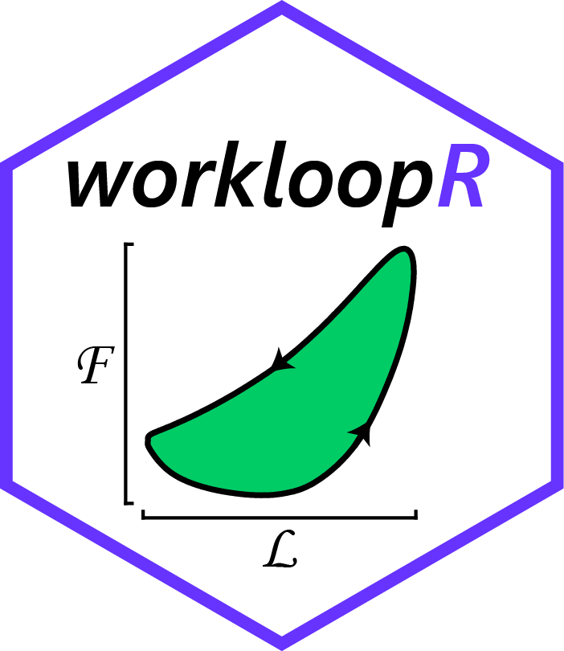

# posts by vikram
### Sporadically updated, (somewhat) useful stuff: https://vbaliga.github.io/

Although I like using squarespace for my main site, I'm not a fan of the way squarespace formats code. All posts here will be made via the magic of [R Markdown](https://rmarkdown.rstudio.com/). 

My main website can be found [here](https://www.vikram-baliga.com/).  
  
### Other info

  
Click here for more

> raw markdown files for each post can be found in `/_posts/`  
> corresponding images (usually figures made in R) will be placed in `/images/`  
> I set up this blog by forking it from [barryclark/jekyll-now](https://github.com/barryclark/jekyll-now) and then modifying it to my liking.  
> The theme is modified from [orderedlist/minimal](https://github.com/orderedlist/minimal).

🐢

